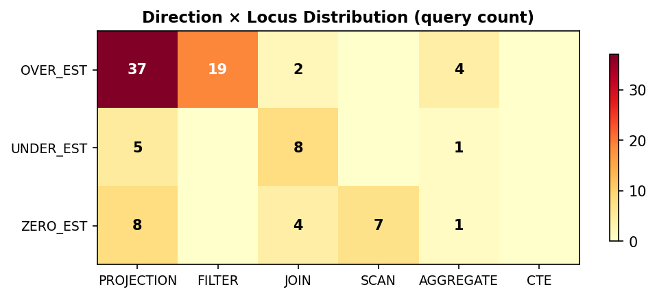
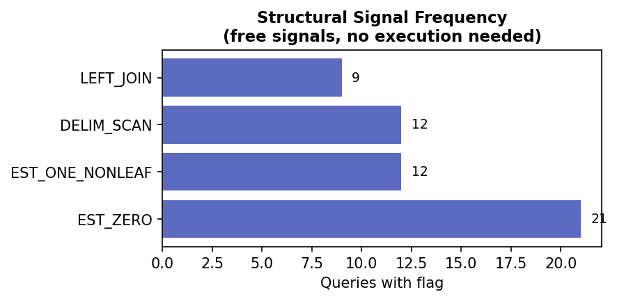

# Q-Error Analysis Report: DuckDB TPC-DS SF10

**101 queries | DuckDB 1.4.3 | EXPLAIN (ANALYZE, FORMAT JSON)**

## Key Finding

Q-Error (cardinality estimation error) identifies **where** and **how** the DuckDB
optimizer misjudges row counts. This is directly actionable: each (locus, direction)
pair maps to specific rewrite pathologies (P0-P9).

## 1. Coverage

| Metric | Value |
|--------|-------|
| Queries with Q-Error signals | **96** / 101 |
| Missing plan_json (DuckDB limitation) | 4 |
| Accurate (no misestimates Q>2) | 1 |

## 2. Severity Distribution

| Severity | Count | % | Meaning |
|----------|------:|--:|---------|
| CATASTROPHIC_BLINDNESS | 29 | 28% | Q > 10,000 — planner off by 4+ orders of magnitude |
| MAJOR_HALLUCINATION | 38 | 37% | Q 100-10K — planner off by 2-4 orders |
| MODERATE_GUESS | 27 | 26% | Q 10-100 — planner off by 1-2 orders |
| MINOR_DRIFT | 2 | 1% | Q 2-10 — small but measurable mismatch |
| ACCURATE | 1 | 0% | Q < 2 — estimates are reasonable |

## 3. Q-Error per Query

Bar color = benchmark optimization outcome (green = WIN, red = REGRESSION).
Dashed lines mark severity thresholds.

## 4. Where is the Optimizer Wrong? (Direction × Locus)

**How to read**: Each cell = number of queries where the worst Q-Error is at that
(direction, locus) combination.

| Direction | Meaning | Count | Actionable signal |
|-----------|---------|------:|-------------------|
| OVER_EST | Planner thinks more rows than actual | 62 | Redundant work, missed pruning → P1, P4, P7 |
| UNDER_EST | Planner thinks fewer rows than actual | 14 | Under-provisioned join/scan → P2, P0 |
| ZERO_EST | Planner estimated 0 (gave up) | 20 | CTE boundary blocks stats → P0, P2, P7 |

| Locus | Where the worst mismatch is | Count | Typical pathology |
|-------|---------------------------|------:|-------------------|
| PROJECTION | Worst Q-Error on projection node | 50 | P7 (CTE split), P0 (pushback), P4 (OR decomp) |
| FILTER | Worst Q-Error on filter node | 19 | P9 (shared expr), P0 (pushback) |
| JOIN | Worst Q-Error on join node | 14 | P2 (decorrelate), P0 (pushback), P5 (LEFT→INNER) |
| SCAN | Worst Q-Error on scan node | 7 | P1 (repeated scans), P4 (OR decomp), P2 (DELIM_SCAN) |
| AGGREGATE | Worst Q-Error on aggregate node | 6 | P3 (agg below join) |
| CTE | Worst Q-Error on cte node | 0 | P0 (pushback), P7 (CTE split), P2 (decorrelate) |

## 5. Structural Signals (Free — No Execution Needed)

| Flag | Queries | Meaning | Routes to |
|------|--------:|---------|-----------|
| EST_ZERO | 21 | Planner estimated 0 rows on non-trivial node | P0, P7 |
| EST_ONE_NONLEAF | 12 | Planner estimated 1 row on non-leaf — guessing | P2, P0 |
| DELIM_SCAN | 12 | Correlated subquery marker (optimizer couldn't decorrelate) | P2 |
| LEFT_JOIN | 9 | LEFT JOIN present (INNER conversion candidate) | P5 |

## 6. Pathology Routing from Q-Error

| Pathology | Description | Queries routed | Safety |
|-----------|-------------|---------------:|--------|
| P0 | Predicate chain pushback | 96 | Safe with gates |
| P1 | Repeated scans → single pass | 0 | Zero regressions |
| P2 | Correlated subquery decorrelation | 36 | Check EXISTS first |
| P3 | Aggregate below join | 32 | Zero regressions |
| P4 | Cross-column OR decomposition | 79 | Max 3 branches |
| P5 | LEFT JOIN → INNER conversion | 55 | Zero regressions |
| P6 | INTERSECT → EXISTS | 30 | Zero regressions |
| P7 | Self-joined CTE split | 79 | Check orphan CTE |
| P8 | Deferred window aggregation | 0 | Zero regressions |
| P9 | Shared subexpression extraction | 53 | Never on EXISTS |

## 7. Q-Error vs Optimization Outcomes

| Severity | Queries | Wins | Win Rate | Avg Speedup (wins) |
|----------|--------:|-----:|---------:|-------------------:|
| CATASTROPHIC_BLINDNESS | 29 | 9 | 31% | 1.86x |
| MAJOR_HALLUCINATION | 38 | 11 | 28% | 1.66x |
| MODERATE_GUESS | 27 | 7 | 25% | 2.06x |
| MINOR_DRIFT | 2 | 2 | 100% | 1.27x |

## 8. Top 15 Highest Q-Error Queries

| Query | Max Q-Error | Locus | Direction | Routing | Outcome | Speedup |
|-------|------------:|-------|-----------|---------|---------|--------:|
| query_31 | 18,446,744,073,709,551,616 | PROJECTION | ZERO_EST | P6,P0,P7,P4,P5 | IMPROVED | 1.04x |
| query_4 | 29,800,878,955,912,040 | PROJECTION | OVER_EST | P7,P0,P4,P9,P5,P2 | IMPROVED | 1.03x |
| query_11 | 134,079,072,124 | PROJECTION | OVER_EST | P7,P0,P4,P9,P5,P2 | WIN | 4.00x |
| query_74 | 127,905,383,369 | PROJECTION | OVER_EST | P7,P0,P4,P9,P5,P2 | WIN | 1.36x |
| query_37 | 11,282,927 | AGGREGATE | OVER_EST | P3,P5,P0,P7,P4 | WIN | 1.30x |
| query_82 | 7,534,531 | AGGREGATE | OVER_EST | P3,P5,P0,P7,P4 | WIN | 1.18x |
| query_2 | 4,522,963 | PROJECTION | ZERO_EST | P6,P0,P7,P4,P3 | ERROR | 2.10x |
| query_17 | 887,484 | PROJECTION | ZERO_EST | P6,P0,P2 | WIN | 1.19x |
| query_35 | 280,065 | SCAN | ZERO_EST | P2,P0 | ERROR | 1.51x |
| query_6 | 253,760 | JOIN | ZERO_EST | P0,P2,P3,P7,P4,P5 | WIN | 1.33x |
| query_70 | 164,955 | PROJECTION | OVER_EST | P7,P0,P4,P3,P9 | REGRESSION | 0.75x |
| query_1 | 157,800 | JOIN | UNDER_EST | P2,P0,P6,P5 | WIN | 2.92x |
| query_25 | 133,768 | JOIN | ZERO_EST | P0,P2,P7,P4,P6 | NEUTRAL | 0.98x |
| query_30 | 127,710 | PROJECTION | UNDER_EST | P6,P5,P0,P2 | ERROR | 0.00x |
| query_8 | 105,154 | PROJECTION | OVER_EST | P7,P0,P4,P3,P5 | IMPROVED | 1.06x |

## 9. Actionable Routing Table

This is the decision table that maps Q-Error signals to interventions:

| Q-Error Locus | Direction | Intervention | Transform | Example wins |
|---------------|-----------|-------------|-----------|-------------|
| JOIN | UNDER_EST | Decorrelate to CTE + hash join | `decorrelate` | Q1 2.92x, Q35 2.42x |
| JOIN | ZERO_EST | Push predicate into CTE | `predicate_pushback` | Q6 4.00x, Q11 4.00x |
| JOIN | OVER_EST | Convert LEFT→INNER if WHERE on right | `inner_join_conversion` | Q93 3.44x |
| SCAN | OVER_EST | Consolidate repeated scans | `single_pass_agg` | Q88 6.24x, Q9 4.47x |
| SCAN | ZERO_EST | Decorrelate (DELIM_SCAN) | `decorrelate` | Q35 2.42x |
| AGGREGATE | OVER_EST | Push GROUP BY below join | `aggregate_pushdown` | Q22 42.90x |
| CTE | ZERO_EST | Push selective predicate into CTE | `date_cte_isolate` | Q63 3.77x |
| PROJECTION | OVER_EST | Split self-joined CTE | `self_join_decomp` | Q39 4.76x |
| PROJECTION | UNDER_EST | Replace INTERSECT with EXISTS | `intersect_to_exists` | Q14 2.72x |

---

*Generated by `qerror_report.py` from EXPLAIN (ANALYZE, FORMAT JSON) on 101 TPC-DS queries.*